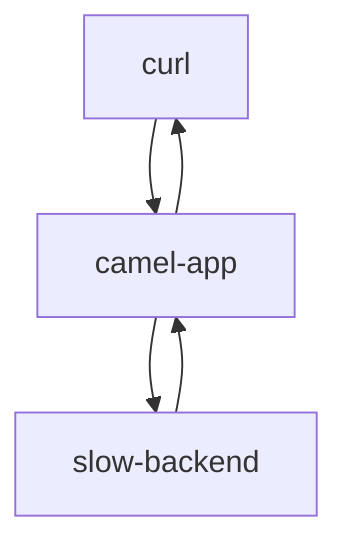

# Introduction

This project provides performance testing of 3 different HTTP clients for Camel On Quarkus (Camel producerts): Netty, Vertx and the Apache HTTP Client.

# Architecture



# Compile the code

```
./mvnw clean install
```

# Run the slow backend simulator

In a 1st terminal, run
```
java -jar slow-backend/target/quarkus-app/quarkus-run.jar
```

# Run the Camel Application

In a second terminal, run:
```
java -jar camel-app/target/quarkus-app/quarkus-run.jar
```

# Testing Performance of different http clients

The syntax of the testing script is `./scripts/load_test.sh $HTTP_CLIENT $NUM_REQ` where 

* `HTTP_CLIENT` is one of `http` (Apache HTTP Client), `vertx` or `netty`
* `NUM_REQ` is the number of parralel requests to 

For example, run the following command in a 3rd terminal to send 50 concurrent requests using the vertx client:
```
time ./scripts/load_test.sh vertx 50
```

Or to send 1,000 concurrent requests using the netty client:

```
time ./scripts/load_test.sh netty 1000
```

Or 100 requests using the Apache HTTP Client:
```
time ./scripts/load_test.sh http 100
```
